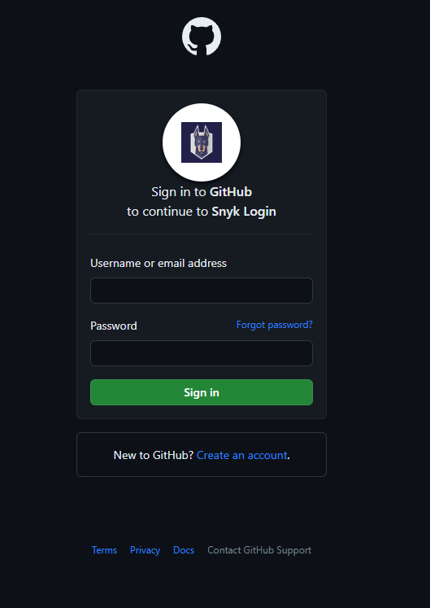
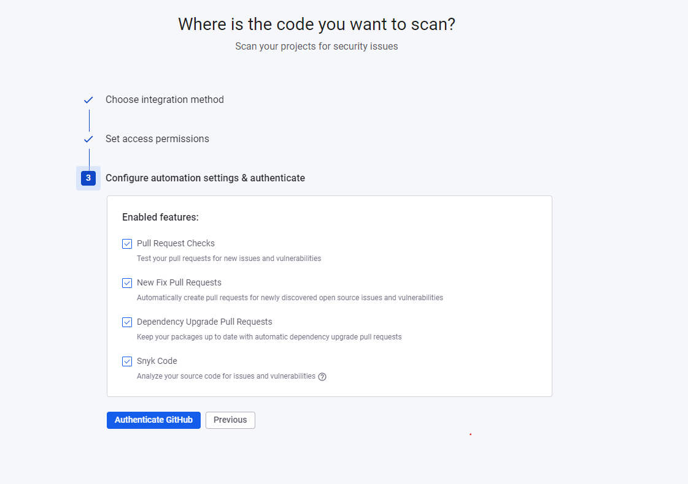
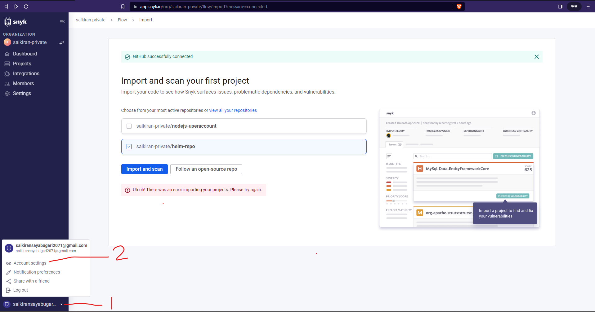
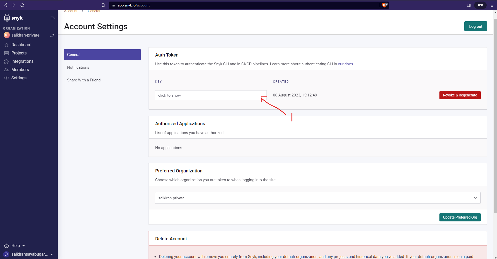
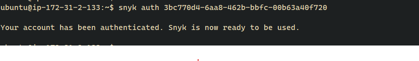
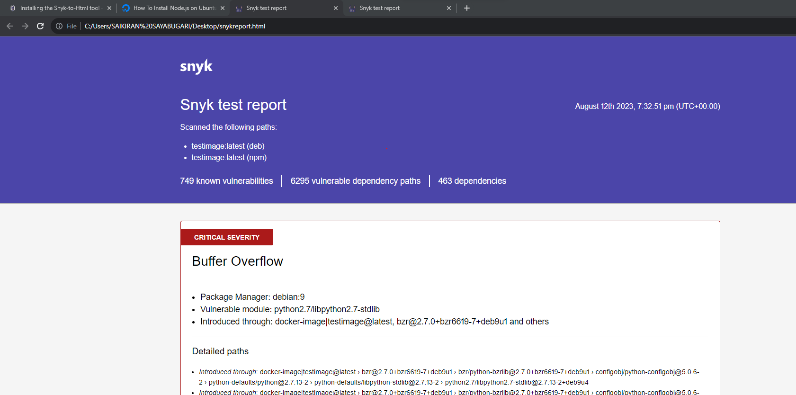
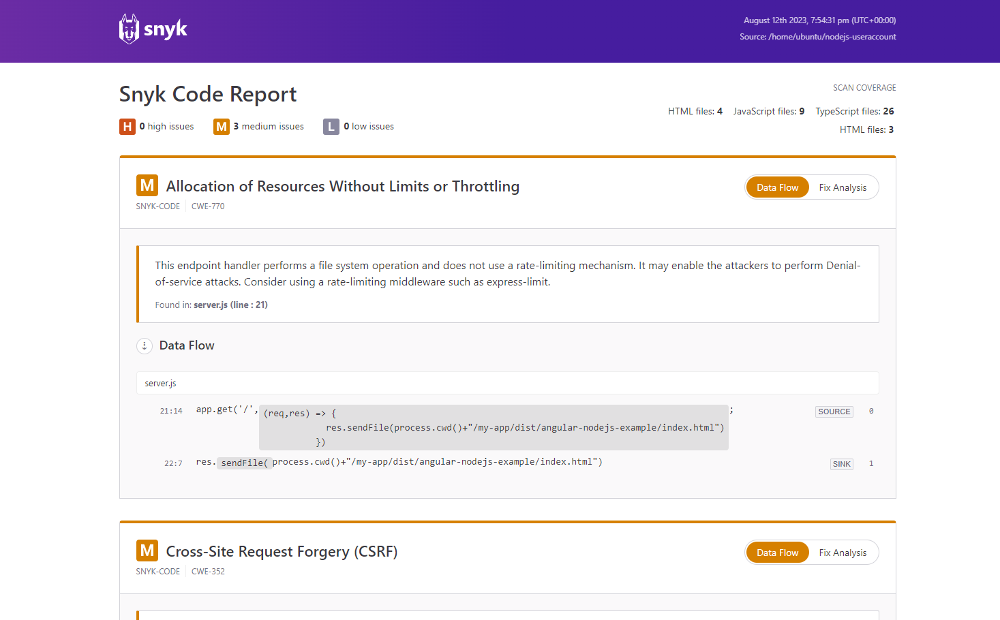
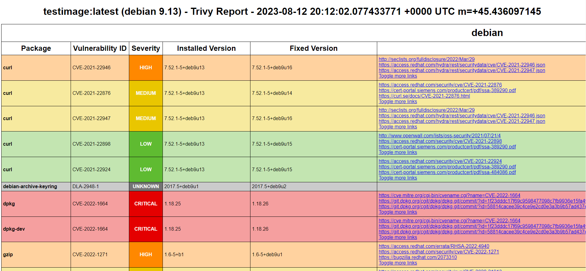

# Creation of snyk account

### 1. Snyk Account creation
 Goto https://snyk.io/ and click on Signup

#### 1a. 2 ways of authentications are available select appropriate ones.
Here, Lets go with GitHub based authentication, Click on Github from the image below.

#### 1b. select github as shown below, and clik on next steps from the below page

Enter the credentials of the github from which snyk to be authenticated.

#### 1c. select the repository type public or private as shown below and click on next step

#### 1d. click on the authenticate github

your snyk will be authneticated. Now you can use snyk to scan your repos from the UI.
The repos will be listed if you have multiple repos in your namespace. You can select any one repo to scan. The  results will be shown as below.

### 2. Now API token has to be created to use it in the jenkins pipeline and also to use Snyk CLI
#### 2a. Goto your username(1) and click on the Account-settings(2) as shown below

 

#### 2b. Click to the below shown location, It will show you the API token for your authenticated account. Copy it and store it safely, This will be required during authentication of your jenkins slave node where the pipelines are run.

 

### 3. Installing Docker if not available
follow the steps mentioned in the link. https://docs.docker.com/engine/install/ubuntu/

    sudo apt-get update
    sudo apt-get install ca-certificates curl gnupg

    sudo install -m 0755 -d /etc/apt/keyrings
    
    curl -fsSL https://download.docker.com/linux/ubuntu/gpg | sudo gpg --dearmor -o /etc/apt/keyrings/docker.gpg
    
    sudo chmod a+r /etc/apt/keyrings/docker.gpg

    echo \
    "deb [arch="$(dpkg --print-architecture)" signed-by=/etc/apt/keyrings/docker.gpg] https://download.docker.com/linux/ubuntu \
    "$(. /etc/os-release && echo "$VERSION_CODENAME")" stable" | \
    sudo tee /etc/apt/sources.list.d/docker.list > /dev/null

    sudo apt-get update

    sudo apt-get install docker-ce docker-ce-cli containerd.io docker-buildx-plugin docker-compose-plugin

    sudo docker run hello-world

    sudo groupadd docker

    sudo usermod -aG docker $USER

Log out and log back in so that your group membership is re-evaluated.

### 4. Installing the CLI in the jenkins Slave node. 

#### 4a. Login to the jenkins slave machine, you can usethe following command.
    ssh -i "<pem file>" ubuntu@<Public IPv4 DNS>
#### 4b. Install snyk CLI, Run the following commands
    curl https://static.snyk.io/cli/latest/snyk-linux -o snyk
   
    chmod +x ./snyk
   
    mv ./snyk /usr/local/bin/ 

    snyk auth <SNYK_TOKEN>  

This token is aquired in the 2b step. Copy that token here

After the command is excuted, the below image will be displayed. 
 

#### 4c. Report generation and Uploading to snyk UI

 ##### Install npm 
    
    sudo apt update

    sudo apt install nodejs

    node -v

    sudo apt install npm

 ##### snyk-to-html tool which will help in the sending the CLI reports to html

    sudo npm install snyk-to-html -g

##### To get the reports run the below command which will scan the docker images.

    snyk container test <image_name>:<image_tag> --json | snyk-to-html --output snykreport.html

 

##### Scan code and get reports

snyk code test --json | snyk-to-html --output codescan.html

C:\Users\SAIKIRAN SAYABUGARI\Desktop\Git Apr-2023\apr-gitclass\snyk documentation\snyk_code_test.png

# TRIVY Image and code scan
Trivy is used as an alternative to snyk. Trivy is an opensource. Either of the tools can be used. 

Trivy installation. Execute the below commands.

    wget -qO - https://aquasecurity.github.io/trivy-repo/deb/public.key | gpg --dearmor | sudo tee /usr/share/keyrings/trivy.gpg > /dev/null

    echo "deb [signed-by=/usr/share/keyrings/trivy.gpg] https://aquasecurity.github.io/trivy-repo/deb $(lsb_release -sc) main" | sudo tee -a /etc/apt/sources.list.d/trivy.list

    sudo apt-get update

    sudo apt-get install trivy

The docker image has to be built before generating the trivy reports. 

    docker build -t "$imagename" -f "$dockerfile" $dockerfile_dir --no-cache

Execute the below Trivy command to generate the report for image

    trivy image $image:latest --ignore-unfixed --format template --template "@/usr/local/share/trivy/templates/html.tpl" -o report.html

The above command will generate the report as shown below. Open the report.html to view this. 

 
